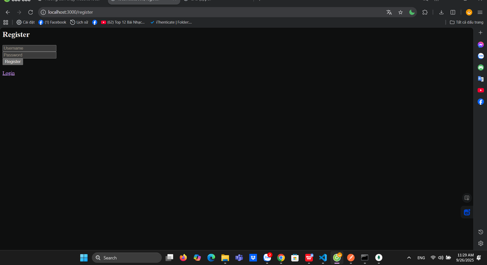
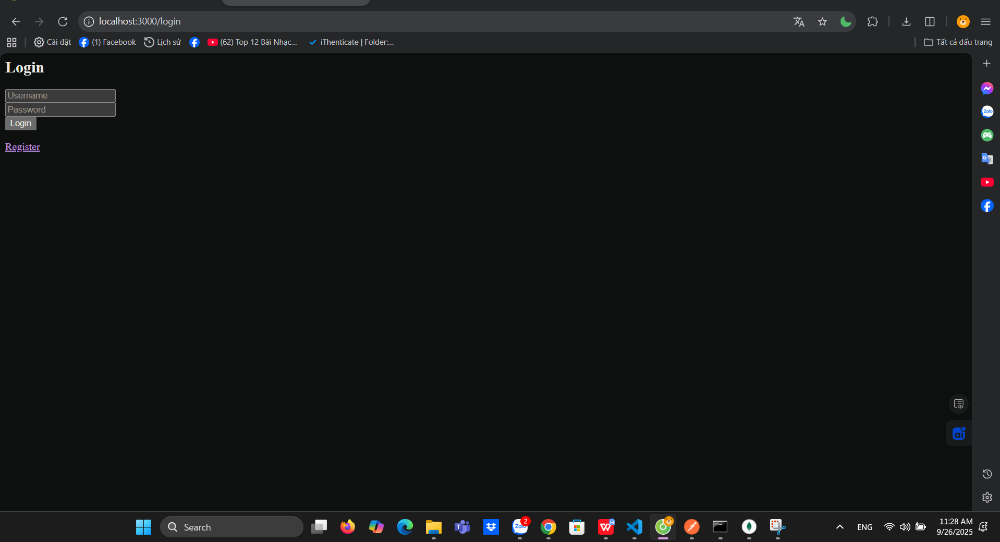
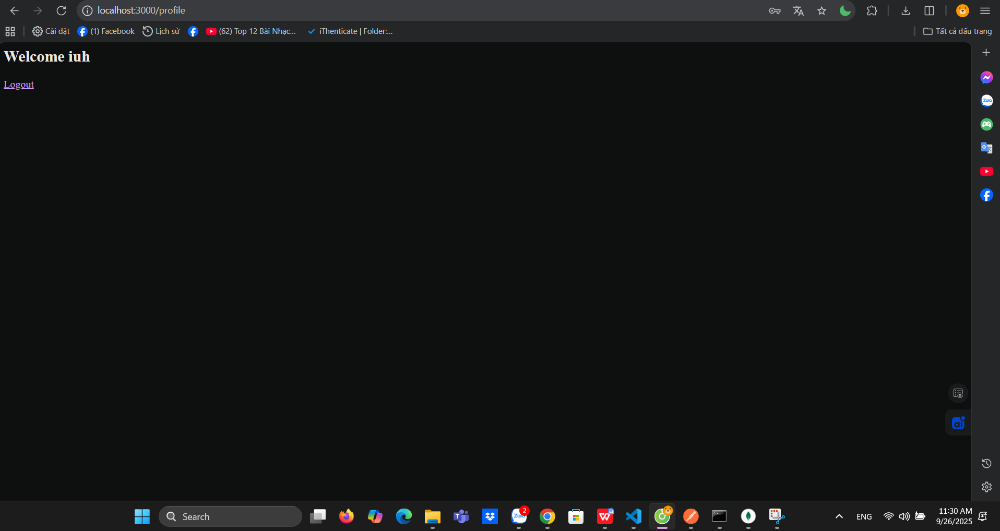

# Local Passport Website

## 📌 Mô tả
Dự án minh họa cách tạo website **đăng ký, đăng nhập, đăng xuất** sử dụng **Passport.js (local strategy)** trên **Node.js**.  
Website chạy hoàn toàn **local** trên máy cá nhân (localhost) và lưu user vào file `users.json`.

---

## 🚀 Cài đặt & chạy
- npm install   
- node app.js 
## Chạy chức năng trên localhost
1.Register: http://localhost:3000/register

## Chạy chức năng trên localhost
2.Login : http://localhost:3000/login

## Chạy chức năng trên localhost
2.profile : http://localhost:3000/profile
